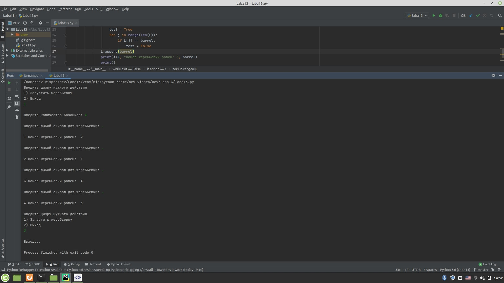

# Laba13

Данная программа проводит жеребьевку методом случайных чисел. Она выводит N случайных (не повторяющихся) чисел.
Есть интерфейс. В начале 1) Запустить жеребьевку 2) Выход. 

Проект можно открыть в среде пронраммирования Pycharm. Файл написан на языке python.
Открывать файл "laba13.py"
